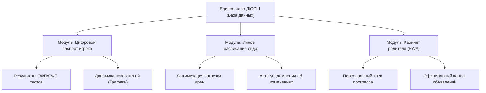

# 🚀 Цифровая Академия: Концепция технологической модернизации ДЮСШ ХК «Барыс» / КФХ

> **Автор:** Битанов Айдан, эксперт по цифровой трансформации (10+ лет опыта в IT-управлении C-level: АО «QazIndustry», АО «Казпочта», АО «НИХ «Зерде»)  
> **Контактный телефон:** +7 701 956 30 20  
> **Электронная почта:** adn.bitanov@gmail.com  
> **Локация:** г. Астана, Казахстан  

---

## 1. Введение и актуальность

Современный профессиональный хоккей строится на работе с данными и эффективном использовании инфраструктуры. Развитие детско-юношеского спорта является главным государственным приоритетом Республики Казахстан (согласно поручениям Главы государства по развитию массового и детского спорта). 

При этом детско-юношеские спортивные школы (ДЮСШ) часто сталкиваются со скрытыми внутренними барьерами, которые мешают им работать на полную мощность. 

Данная концепция предлагает **аккуратный, поэтапный подход к цифровизации ДЮСШ ХК «Барыс» (или Академии КФХ)**. Проект направлен на то, чтобы сделать детскую школу передовой технологической площадкой в СНГ, повысить лояльность общественности и создать прозрачную систему подготовки резерва для основных команд.

---

## 2. Анализ текущих проблем ДЮСШ («Боли» системы)

| Сфера | Текущая проблема | Последствия |
| :--- | :--- | :--- |
| **Спортивный отбор** | Субъективная оценка качеств юных игроков тренерами. Отсутствие единой базы данных тестов. | Жалобы родителей на «блат» и кумовство при формировании составов звеньев. Социальное напряжение вокруг школы. |
| **Планирование ресурсов** | Ручное составление расписания льда в Excel и координация через WhatsApp. | «Дыры» в расписании дефицитного льда, организационные накладки, простой дорогостоящей инфраструктуры арен. |
| **Коммуникация** | Хаотичные WhatsApp-чаты родительских комитетов и тренеров. | Утеря важной информации, слухи, конфликты, непрозрачность организационных сборов на выезды/экипировку. |
| **Мониторинг резерва** | Нет сквозного отслеживания динамики показателей игрока с 5 до 17 лет. | Клуб «теряет» талантливых ребят при переходе из юношеского во взрослый хоккей из-за отсутствия аналитической истории. |

---

## 3. Целевые модули цифровой платформы ДЮСШ

Проект не требует сноса существующих процессов. Внедрение происходит в виде легких цифровых модулей, которые гармонично дополняют работу тренеров и администрации.



### Модуль 1. «Цифровой паспорт игрока» (Sports Analytics)
* **Что это:** Единая база данных, где по каждому воспитаннику школы ведется личная карточка:
  * Антропометрические данные (рост, вес).
  * Результаты регулярных тестов по ОФП (бег, прыжки, подтягивания) и СФП (ледовые тесты: челночный бег, броски, катание).
  * Оценки тренеров за дисциплину и игровое мышление.
* **Главный плюс для руководства:** **100% репутационная защита.** При возникновении вопросов от родителей о причинах непопадания ребенка в первый состав, директор ДЮСШ демонстрирует объективный график тестов ребенка в сравнении со средними показателями команды. Вопрос закрывается на основе цифр, а не эмоций.

### Модуль 2. «Умное расписание» (Resource Planning)
* **Что это:** Простой интерактивный календарь занятости ледовых арен и залов ОФП. 
* **Главный плюс для руководства:** Система автоматически оптимизирует расписание, исключает накладки и минимизирует простой арен. Тренеры и родители получают автоматические SMS/Push-уведомления при любом изменении времени тренировки.

### Модуль 3. «Родительский портал» (PWA / Мобильное приложение)
* **Что это:** Удобный, закрытый личный кабинет родителя в телефоне (без необходимости скачивания из App Store/Google Play — через PWA-технологию).
* **Главный плюс для руководства:** Вся официальная информация (расписание, требования по экипировке, медицинские допуски) идет из одного легитимного источника. Это полностью уничтожает «информационный шум» и конфликты в родительских чатах.

---

## 4. Стратегическая ценность для руководства («Зачем это нужно?»)

```
┌────────────────────────────────────────────────────────────────────────┐
│                        ВЫГОДЫ ДЛЯ ТОП-МЕНЕДЖМЕНТА                      │
├──────────────────────────────┬─────────────────────────────────────────┤
│ Политический кейс            │ Образцово-показательный проект для      │
│                              │ Министерства спорта и Акимата по        │
│                              │ развитию детского массового спорта.     │
├──────────────────────────────┼─────────────────────────────────────────┤
│ Безопасность и спокойствие   │ Снятие обвинений в коррупции и блате    │
│                              │ при отборе детей за счет прозрачных     │
│                              │ цифровых метрик.                        │
├──────────────────────────────┼─────────────────────────────────────────┤
│ Экономия и контроль          │ Оптимизация дорогостоящего ледового     │
│                              │ времени и четкий учет выдаваемой       │
│                              │ экипировки (ТМЦ).                       │
└──────────────────────────────┴─────────────────────────────────────────┘
```

---

## 5. Дорожная карта аккуратного внедрения (Roadmap)

Мы действуем по методологии **Agile** (маленькими шагами с быстрыми результатами), чтобы не перегружать структуру ДЮСШ.

```
[Этап 1: Проектирование] ──> [Этап 2: Пилот (1 группа)] ──> [Этап 3: Масштабирование на ДЮСШ] ──> [Этап 4: Трансляция на клуб]
      (2-3 недели)                    (1-2 месяца)                       (2-3 месяца)                     (Перспектива)
```

### Этап 1. Проектирование и Прототип (2–3 недели)
* Разработка точной архитектуры базы данных.
* Создание **интерактивного кликабельного дизайн-макета (прототипа)** системы для демонстрации руководству «Барыса» / КФХ на экране смартфона.


* *Результат:* Готовое визуальное решение, которое можно «потрогать руками».

### Этап 2. Пилотный запуск (1–2 месяца)
* Запуск системы в тестовом режиме на **одной возрастной группе** (например, «Барыс-2015»).
* Сбор обратной связи от тренеров пилотной группы и родителей.
* Устранение мелких багов, калибровка системы тестирования.
* *Результат:* Работающий живой кейс с первыми реальными данными.

### Этап 3. Масштабирование на ДЮСШ (2–3 месяца)
* Подключение всех возрастов Академии.
* Интеграция с расписанием ледовых дворцов («Барыс Арена», ЛД «Казахстан»).
* Обучение администраторов и тренерского штаба.
* *Результат:* Полностью оцифрованная, современная хоккейная академия.

### Этап 4. Трансляция опыта на всю вертикаль (Перспектива)
После успешного кейса в ДЮСШ, технологии и полученное доверие руководства транслируются дальше:
* На фарм-клубы («Номад», «Снежные Барсы») для сквозного отслеживания перехода игроков.
* На административный контур первой команды ХК «Барыс» (логистика перелетов КХЛ, автоматизация складского учета ТМЦ, CRM-система болельщиков).
* На масштаб всей страны через КФХ (цифровизация региональных ДЮСШ Казахстана).

---

## 6. Резюме

Внедрение цифровой платформы в ДЮСШ — это **стратегически безопасный, недорогой и крайне эффективный шаг** для любого хоккейного руководителя в Казахстане. Он решает насущные проблемы детской школы, защищает руководство от социального негатива и служит идеальным отчетом для вышестоящих инстанций. 

Для меня этот проект — не просто работа, а личный вызов. Мой управленческий опыт в IT C-level гарантирует, что система будет спроектирована надежно, сдана вовремя и в строгом соответствии со всеми стандартами корпоративного управления квазигосударственного сектора.
