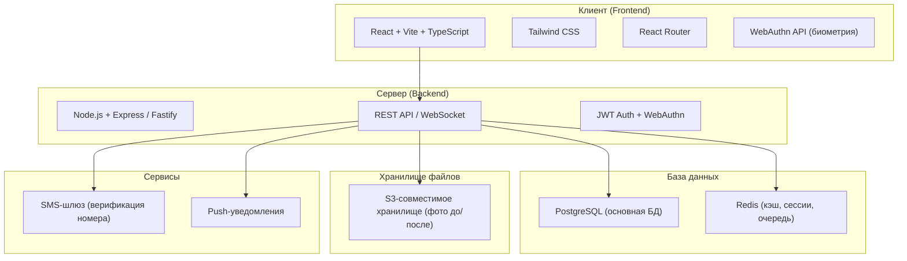
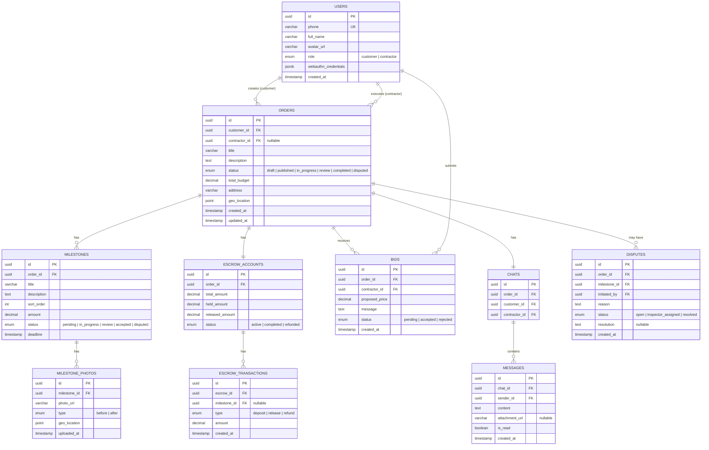
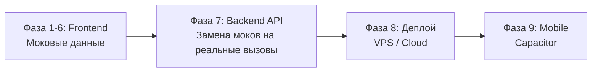

# 🚀 ГарантСтрой MVP — Мастер-план разработки

> Полный пошаговый план от архитектуры до публикации в интернете.

---

## 📐 1. Архитектура системы



### Принцип: Mobile-first SPA
- Фронтенд — одностраничное приложение (SPA), адаптивное, mobile-first
- Бэкенд — REST API + WebSocket для чата
- В будущем — упаковка в нативное приложение через **Capacitor**

---

## 🗄 2. Структура базы данных (PostgreSQL)



---

## 📁 3. Структура проекта (Frontend)

```
Startup-Rocket/
├── public/
├── src/
│   ├── assets/              # Иконки, изображения
│   ├── components/          # Переиспользуемые UI-компоненты
│   │   ├── ui/              # Кнопки, инпуты, карточки, модалки
│   │   ├── BottomNav.tsx
│   │   └── Header.tsx
│   ├── layouts/
│   │   └── MobileLayout.tsx
│   ├── pages/
│   │   ├── auth/            # Онбординг, вход, выбор роли
│   │   ├── customer/        # Экраны заказчика
│   │   ├── contractor/      # Экраны исполнителя
│   │   ├── Dashboard.tsx
│   │   ├── Orders.tsx
│   │   └── Profile.tsx
│   ├── hooks/               # Кастомные React-хуки
│   ├── services/            # API-клиент, WebAuthn-сервис
│   ├── store/               # Глобальное состояние (zustand)
│   ├── types/               # TypeScript типы/интерфейсы
│   ├── utils/               # Вспомогательные функции
│   ├── mock/                # Моковые данные для MVP
│   ├── App.tsx
│   ├── main.tsx
│   └── index.css
├── Dockerfile
├── docker-compose.yml
├── package.json
├── tsconfig.json
└── vite.config.ts
```

---

## 📋 4. Чек-лист разработки (подробный)

### Фаза 1: Фундамент (Этап сейчас ✅ частично)
- [x] Инициализация React + Vite + TypeScript
- [x] Установка зависимостей (Tailwind, Router, Lucide, Framer Motion)
- [x] Настройка дизайн-системы (цвета, шрифты, переменные)
- [x] Базовый роутинг (React Router)
- [x] MobileLayout (Header + BottomNav + Outlet)
- [ ] UI-компоненты: Button, Input, Card, Modal, Badge, Avatar
- [ ] Подключение Google Fonts (Inter)
- [ ] Dockerfile и docker-compose для dev-окружения

### Фаза 2: Авторизация и Онбординг
- [ ] Экран приветствия (Welcome / Splash Screen)
- [ ] Вход по номеру телефона (UI + моковая верификация)
- [ ] Экран выбора роли (Заказчик / Исполнитель)
- [ ] Настройка Face ID / Touch ID (WebAuthn API)
- [ ] Заполнение профиля (имя, фото, данные)
- [ ] Хранение состояния авторизации (zustand + localStorage)

### Фаза 3: Кабинет Заказчика
- [ ] Дашборд: баланс эскроу, активные заказы, уведомления
- [ ] Создание заказа: пошаговая форма
  - [ ] Описание работ
  - [ ] Адрес (с картой)
  - [ ] Разбивка на этапы (milestones) с бюджетом
  - [ ] Предпросмотр и публикация
- [ ] Просмотр откликов исполнителей
- [ ] Выбор исполнителя
- [ ] Эскроу-эмулятор: внесение средств, просмотр транзакций

### Фаза 4: Кабинет Исполнителя
- [ ] Лента доступных заказов (с фильтрами)
- [ ] Карточка заказа (детали, этапы, бюджет)
- [ ] Подача отклика (предложение цены + сообщение)
- [ ] Экран активного заказа
  - [ ] Текущий этап
  - [ ] Загрузка фото "до/после"
  - [ ] Гео-метка (браузерная геолокация)
  - [ ] Кнопка "Этап завершён"

### Фаза 5: Приёмка, Споры и Чат
- [ ] Уведомление заказчику о завершении этапа
- [ ] Сравнение фото "до/после"
- [ ] Приёмка этапа (подтверждение через WebAuthn / Face ID)
- [ ] Автоматическое разблокирование средств из эскроу
- [ ] Чат между заказчиком и исполнителем (WebSocket / мок)
- [ ] Открытие спора
- [ ] Экран Технадзора (просмотр материалов, вынесение решения)

### Фаза 6: Полировка и Тестирование
- [ ] Анимации переходов между страницами (Framer Motion)
- [ ] Pull-to-refresh, скелетоны загрузки
- [ ] Haptic feedback (Vibration API)
- [ ] Адаптивность: Mobile (375px), Tablet (768px), Desktop (1280px)
- [ ] E2E тестирование основного флоу
- [ ] Проверка PWA: Service Worker, manifest.json, оффлайн-режим

### Фаза 7: Бэкенд (когда фронт готов)
- [ ] Настройка Node.js + Express/Fastify
- [ ] Подключение PostgreSQL (Prisma ORM)
- [ ] Миграции базы данных
- [ ] API: авторизация (SMS + JWT)
- [ ] API: CRUD заказов, этапов, откликов
- [ ] API: эскроу-логика
- [ ] API: чат (WebSocket)
- [ ] API: загрузка файлов (S3)
- [ ] API: WebAuthn (серверная часть)

### Фаза 8: Деплой и Публикация
- [ ] Выбор хостинга (см. рекомендации ниже)
- [ ] CI/CD: GitHub Actions (автодеплой)
- [ ] SSL-сертификат (обязателен для WebAuthn)
- [ ] Домен и DNS
- [ ] Мониторинг и логирование

### Фаза 9: Мобильное приложение
- [ ] Интеграция Capacitor
- [ ] Настройка нативных плагинов (камера, геолокация, push)
- [ ] Сборка iOS (Xcode) и Android (Android Studio)
- [ ] Публикация в App Store и Google Play

---

## 🌐 5. Рекомендации по хостингу и инфраструктуре

### Вариант A: Бюджетный старт (MVP) — ~$10-25/мес

| Компонент | Сервис | Стоимость |
|-----------|--------|-----------|
| **Frontend** | Vercel или Cloudflare Pages | Бесплатно |
| **Backend API** | Railway.app или Render.com | ~$5-7/мес |
| **PostgreSQL** | Supabase (бесплатный tier) или Neon.tech | Бесплатно → $5/мес |
| **Redis** | Upstash (бесплатный tier) | Бесплатно |
| **Файлы (S3)** | Cloudflare R2 | ~$0-5/мес |
| **SMS-шлюз** | SMS.ru / SMSC.ru | ~$5-10/мес |
| **Домен** | .ru / .com | ~$10-15/год |

### Вариант B: Продакшн (масштабирование) — ~$50-100/мес

| Компонент | Сервис | Стоимость |
|-----------|--------|-----------|
| **Всё в одном** | VPS (Timeweb Cloud / Selectel) | ~$15-30/мес |
| **PostgreSQL** | Managed DB (Selectel / Yandex Cloud) | ~$15-25/мес |
| **S3 хранилище** | Yandex Object Storage / Selectel S3 | ~$5-10/мес |
| **CDN** | Cloudflare (бесплатно) | Бесплатно |
| **SMS** | SMS.ru | ~$10-20/мес |
| **Мониторинг** | Sentry (бесплатный tier) | Бесплатно |

### Вариант C: Ваш VPS (у вас уже есть — `77.243.80.166`)

> [!TIP]
> У вас уже есть Debian-сервер. Можно использовать его для MVP, развернув всё через Docker Compose — это **самый экономичный** вариант.

| Компонент | Как разворачивать |
|-----------|-------------------|
| Frontend | Nginx (статика) в Docker |
| Backend | Node.js в Docker |
| PostgreSQL | Docker-контейнер |
| Redis | Docker-контейнер |
| Файлы | Локальная папка на VPS |
| SSL | Certbot (Let's Encrypt) — бесплатно |

**Итого: $0/мес** (сверх стоимости VPS, которую вы уже оплачиваете)

---

## ⏱ 6. Ориентировочные сроки

| Фаза | Описание | Срок |
|------|----------|------|
| 1 | Фундамент и UI-компоненты | 2-3 дня |
| 2 | Авторизация и онбординг | 2-3 дня |
| 3 | Кабинет заказчика | 3-4 дня |
| 4 | Кабинет исполнителя | 3-4 дня |
| 5 | Приёмка, споры, чат | 3-4 дня |
| 6 | Полировка | 2-3 дня |
| 7 | Бэкенд | 5-7 дней |
| 8 | Деплой | 1-2 дня |
| **Итого MVP** | | **~3-4 недели** |

> [!IMPORTANT]
> Сроки указаны при совместной работе со мной. Фронтенд с моковыми данными можно получить за ~2 недели, бэкенд подключаем после.

---

## 🧭 7. Стратегия разработки

### Подход: "Frontend-first с моковыми данными"



1. **Сначала** делаем весь фронтенд с моковыми данными — можно показать инвестору/заказчику
2. **Потом** пишем бэкенд и подключаем реальные API
3. **Потом** деплоим на ваш VPS
4. **Потом** оборачиваем в мобильное приложение

> [!NOTE]
> Такой подход позволяет **быстро увидеть результат** — работающий интерфейс за 2 недели, который можно тестировать и показывать.

---

## 🔐 8. Безопасность (ключевые решения)

| Аспект | Решение |
|--------|---------|
| Аутентификация | Телефон + SMS OTP → JWT токены |
| Биометрия | WebAuthn API (FIDO2) — работает в Safari/Chrome |
| Подпись приёмки | WebAuthn challenge при подтверждении этапа |
| Защита API | JWT + Rate Limiting + CORS |
| Эскроу | Серверная логика, клиент не может напрямую управлять средствами |
| Файлы | Подписанные URL для загрузки/скачивания |

---

## ✅ Текущий статус

Уже сделано (Фаза 1, частично):
- [x] React + Vite + TypeScript — инициализирован
- [x] Tailwind CSS + дизайн-система — настроена
- [x] React Router — настроен
- [x] MobileLayout + BottomNav + Header — созданы (в процессе)

**Следующий шаг:** Завершить Фазу 1 — UI-компоненты и Dockerfile.

---

*Создан: 2026-05-05 | Проект: ГарантСтрой MVP v1.0*
